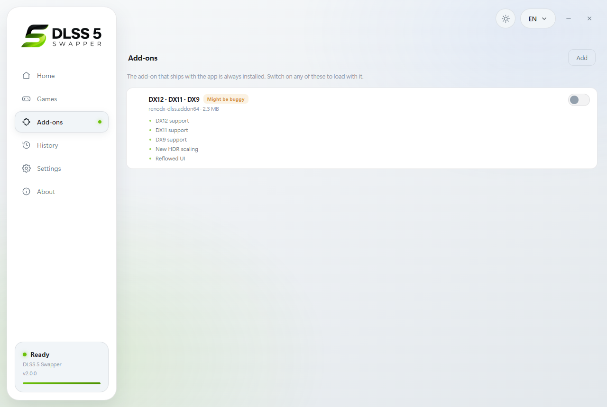

<p align="center">
  
</p>

<h1 align="center">DLSS 5 Swapper</h1>

<p align="center">
  Finds every game on your PC and installs DLSS 5 Neural Rendering in one click.
</p>

<p align="center">
  <a href="../../releases/latest"></a>
  <a href="../../releases"></a>
  
  
  
</p>

<p align="center">
  
</p>

---

## Download

| File | Size | |
| --- | --- | --- |
| **DLSS5-Swapper-Setup-2.0.0.exe** | 224 MB | Installer — shortcuts, clean uninstall |
| **DLSS5-Swapper-2.0.0-portable.exe** | 223 MB | Single file, no installation |

Get either from the [**Releases**](../../releases) page. Windows 10/11 64-bit
and an NVIDIA RTX card. Nothing else to install.

> Not code-signed, so SmartScreen shows *"Windows protected your PC"* the first
> time. Click **More info → Run anyway**.

---

## What's new in 2.0

| | |
| --- | --- |
| **Rebuilt interface** | Sidebar, game library, light and dark themes |
| **Your whole library** | Scans Steam, Epic, GOG, Xbox and every fixed drive |
| **Cover art and banners** | Pulled automatically, no account or key needed |
| **Add-ons screen** | Switch RenoDX builds on and off, add your own |
| **DX11 and DX9** | Through the bundled add-on, alongside DX12 |
| **38 languages** | Up from 2, with full right-to-left support |

---

## Support

### Graphics cards

| Series | |
| --- | --- |
| **RTX 50** | Supported |
| **RTX 40** | Supported |
| **RTX 30** | Supported |
| **RTX 20** | Supported |

The bundled `nvngx_dlssnr.dll` is a patched build whose author states it adds
RTX 20/30/40 support and runs identically on RTX 50.

### Graphics APIs

| API | How |
| --- | --- |
| **DirectX 12** | Works out of the box |
| **DirectX 11** | Switch on the **DX12 · DX11 · DX9** add-on |
| **DirectX 9** | Switch on the **DX12 · DX11 · DX9** add-on |

DX11 and DX9 games are reached by a RenoDX build that bridges them to a D3D12
device. It ships with the app but starts switched off, because it is newer and
its author marks it as possibly buggy.

---

## Your library

<p align="center">
  
</p>

Games are found on their own — no folders to add:

| Source | Found by |
| --- | --- |
| **Steam** | Every library folder, on every drive |
| **Epic Games** | Install manifests |
| **GOG** | Registry entries |
| **Xbox / loose installs** | A sweep of every fixed drive for game folders |

Each card shows the rendering API, the DLSS version in the game, and whether
the add-on is already there. Drag a folder in or use **Add a game** for
anything the sweep misses.

<p align="center">
  
</p>

---

## Installing

<p align="center">
  
</p>

Open a game and the app shows exactly what it found and what it will change:

1. **Finds the executable.** Reads the import table and the delay-load table to
   tell the game apart from its launcher. When a folder holds more than one
   candidate — a DX11 and a DX12 build, say — you pick.
2. **Detects the API.** Static imports first, then embedded entry-point names,
   then the imports of neighbouring game DLLs.
3. **Finds the old DLSS files** wherever they are buried in subfolders.
4. **Backs everything up** before touching a single file.
5. **Swaps the files**, places the add-on beside the executable, and installs
   ReShade silently.

**Restore originals** puts every file back and deletes what the app added — and
removes ReShade only if the app installed it.

---

## Add-ons

<p align="center">
  
</p>

The RenoDX add-on that ships with the app is always installed. The screen lists
the extra builds, and any number of them can be switched on at once.

| | |
| --- | --- |
| **Bundled** | Ships inside the app, nothing to download |
| **Add your own** | Pick any `.addon64` and give it a name, description and tag |
| **Drop-in folder** | An `addons` folder beside the executable is picked up too |

---

## 38 languages

<p align="center">
  
</p>

| | | | |
| --- | --- | --- | --- |
| English | العربية | 简体中文 | 繁體中文 |
| Español | Português | Русский | Deutsch |
| Français | 日本語 | 한국어 | Italiano |
| Türkçe | Polski | Українська | Nederlands |
| Čeština | Magyar | Română | Ελληνικά |
| Svenska | Dansk | Norsk | Suomi |
| ไทย | Tiếng Việt | Bahasa Indonesia | Bahasa Melayu |
| Filipino | हिन्दी | বাংলা | فارسی |
| اردو | Български | Српски | Hrvatski |
| Slovenčina | Català | | |

Arabic, Persian and Urdu flip the whole interface right-to-left. Every step is
recorded as an event code rather than a sentence, so switching language also
re-translates the log already on screen.

---

## Notes

- **Everything is bundled.** The DLSS 5 files, the RenoDX add-ons and the
  ReShade installer all ship inside the app. Nothing is downloaded to install a
  game.
- **Cover art is fetched** from Steam's public store endpoints. No account, no
  key, no sign-in — and it is the only thing the app uses the network for.
- **Your ReShade preset is kept.** If `ReShade.ini` points at a preset, both are
  backed up before an upgrade.
- **Nothing leaves your machine.** No telemetry, no accounts.

---

## Building from source

```
npm install
npm run icon        # squares the artwork and builds build/icon.ico
npm run payload     # gathers the DLSS 5 files, add-ons and ReShade Setup
npm run build       # installer + portable, into dist/
```

`npm run payload` looks for the DLSS 5 files in the parent folder and for
`ReShade_Setup_*_Addon.exe` in `vendor/`, Downloads or Desktop. To point it
elsewhere:

```
npm run payload -- "C:\path\to\dlss 5 files"
```

### Layout

| File | Role |
| --- | --- |
| `src/core/pe.js` | PE reader: imports, delay imports, file version, byte-marker search |
| `src/core/scan.js` | Game and payload scanning, API detection, ReShade detection |
| `src/core/apply.js` | Backup, swap, ReShade install/upgrade, restore |
| `src/library.js` | Steam, Epic, GOG and drive discovery |
| `src/steamart.js` | Cover art, banners and game details |
| `src/renderer/i18n.js` | Every user-facing string, 38 languages |
| `src/renderer/` | Interface, RTL/LTR aware |
| `scripts/` | Payload collection and icon generation |
| `main.js` | Windows, IPC, settings, payload and add-on resolution |

The core modules never produce prose. Each step reports a `{code, params}`
event and the renderer decides the wording.

---

## بالعربي

برنامج يلقى ألعابك كلها بنفسه ويركّب عليها **DLSS 5** بضغطة واحدة.

يمسح ستيم وإبك وGOG وإكس بوكس وكل أقراصك، ويعرض مكتبتك ببوستراتها. تفتح اللعبة
فيوريك ملف التشغيل وواجهة الرسوم وإصدار DLSS الموجود، ثم يأخذ نسخة احتياطية من
كل شي، ويبدّل الملفات، ويحط الأدون، ويثبّت ReShade بصمت.

**يدعم كروت RTX 20 و30 و40 و50**، و**DirectX 12** مباشرة، و**DirectX 11 و9**
عند تشغيل الأدون المرفق.

**كل الملفات مدمجة داخل البرنامج.** الشي الوحيد الذي يُجلب من الإنترنت هو صور
الألعاب من ستيم، بلا حساب ولا مفاتيح.

زر **رجّع الأصلي** يرجّع كل ملف لمكانه ويحذف اللي أضافه.

الواجهة بـ**٣٨ لغة**، والعربية والفارسية والأردية تقلب الواجهة كاملة من اليمين
لليسار.

---

Built by **Rakan Alkhaldi** · MIT licensed
