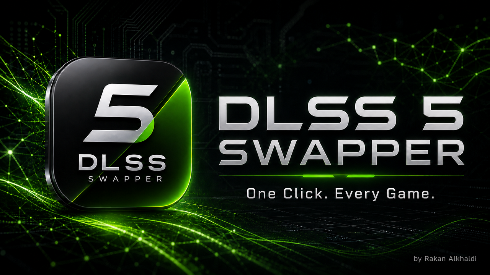
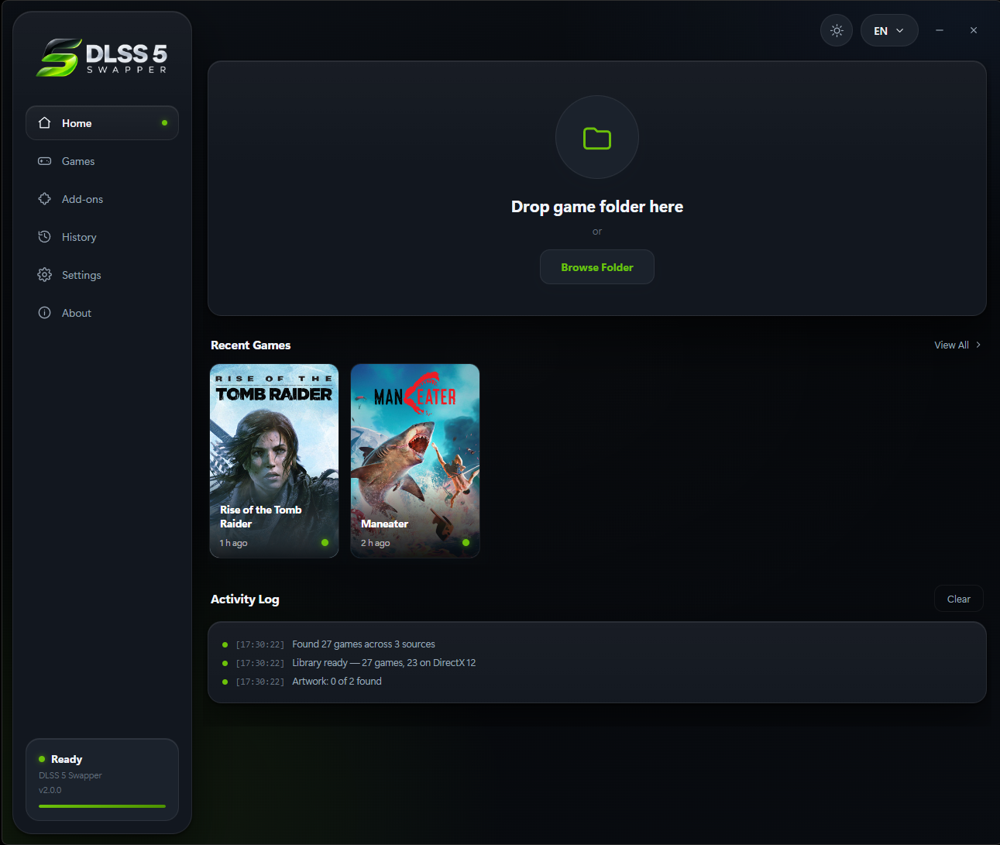
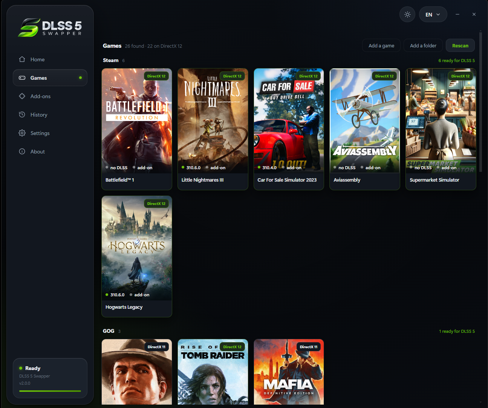
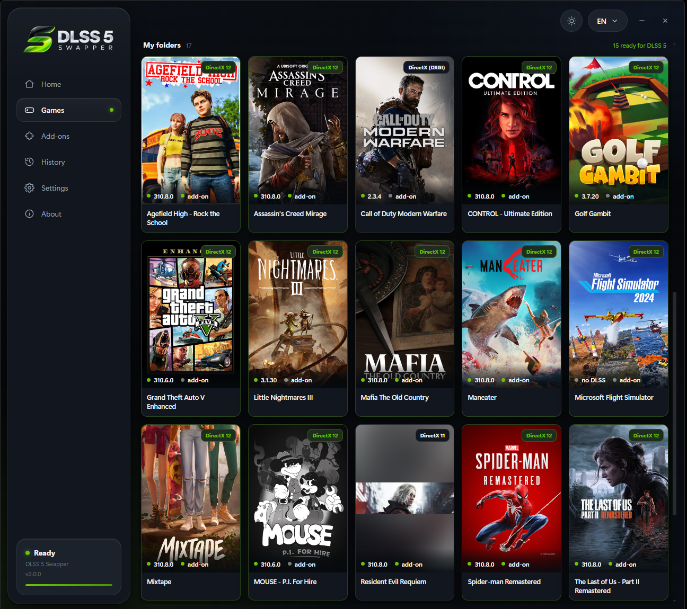
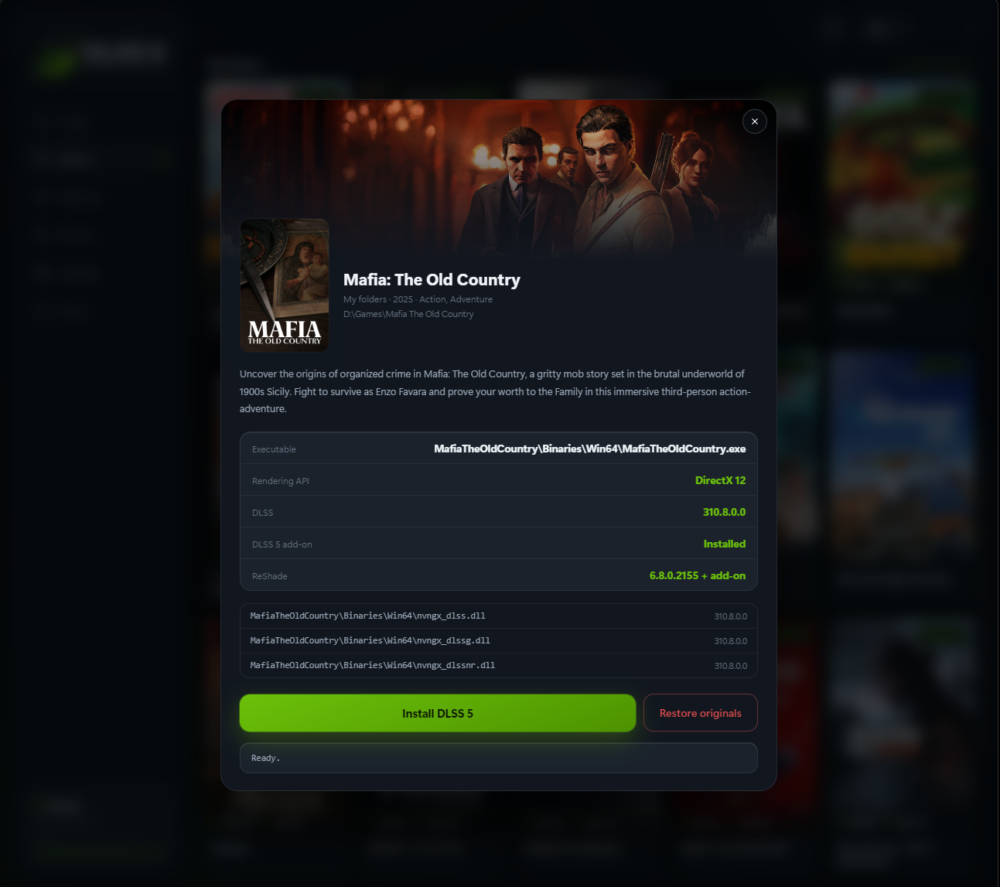
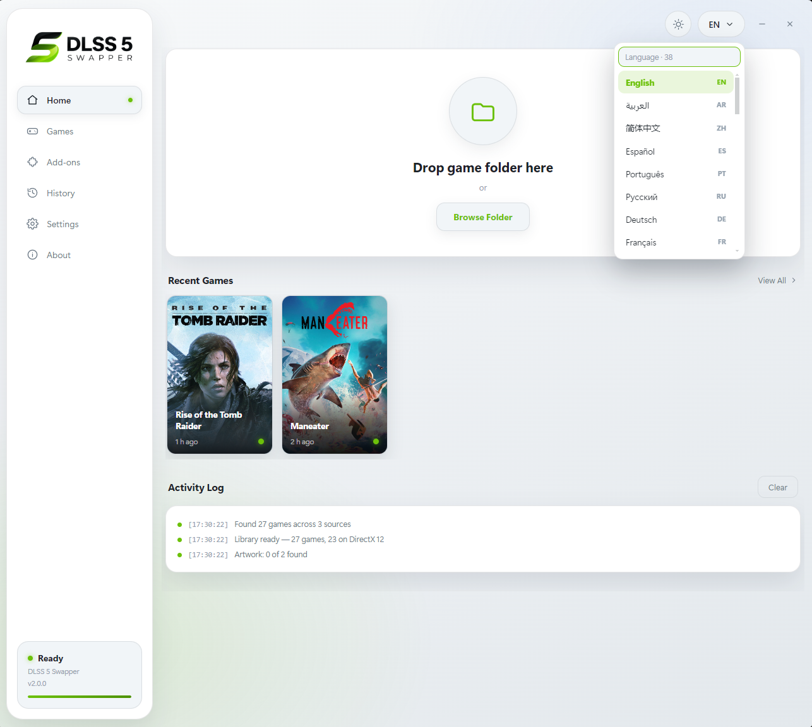

<p align="center">
  
</p>

<h1 align="center">DLSS 5 Swapper</h1>

<p align="center">
  Finds your games and installs DLSS 5 Neural Rendering in one click.
</p>

<p align="center">
  <a href="../../releases/latest"></a>
  <a href="../../releases"></a>
  
  
  
</p>

<p align="center">
  
</p>

---

## Download

| File | Size | |
| --- | --- | --- |
| **DLSS5-Swapper-Setup-2.1.1.exe** | 231 MB | Installer — shortcuts, clean uninstall |
| **DLSS5-Swapper-2.1.1-portable.exe** | 231 MB | Single file, no installation |

Get either from the [**Releases**](../../releases) page. Windows 10/11 64-bit
and an NVIDIA RTX card. Nothing else to install.

### Linux (Steam Play / Proton)

Linux builds are available as AppImage and `.deb`. They support **Windows games
run through Steam Proton**: Steam libraries are discovered from the standard
Linux locations and ReShade Setup runs inside the game's existing Proton
prefix. Launch the game once with a Proton compatibility tool selected before
installing. Native Linux games are not supported because the DLSS 5 and ReShade
payloads are Windows DLLs. The Vulkan Feeder route is not available on Linux;
select a DirectX renderer for Proton games.

> Not code-signed, so SmartScreen shows *"Windows protected your PC"* the first
> time. Click **More info → Run anyway**.

---

## What's new in 2.1.1

### DLSS5-Feeder for games without native DLSS

- A selectable **DLSS5-Feeder** route now supports 64-bit games that never
  create their own DLSS/NGX pipeline. Games without `nvngx_dlss.dll` default to
  this route automatically.
- The game sheet lets you choose the installation route and, for supported
  targets, the rendering API before installing.
- Feeder prefers **LumeniteFX Kernel 2.0** motion vectors, downloaded from the
  author's official repository and SHA-256 verified. The bundled MIT-licensed
  VORT shader remains the offline fallback.
- DirectX 11, DirectX 12, Vulkan and OpenGL Feeder paths are supported. Vulkan
  uses a per-user ReShade layer with reference-counted cleanup.

### Emulator support

DLSS5-Feeder installation is now supported for:

- DuckStation, PCSX2, Dolphin, PPSSPP, Xenia and Cemu.
- RPCS3, Ryujinx, yuzu-family emulators, shadPS4 and Citra-family emulators.
- melonDS, Flycast, xemu, Vita3K, RetroArch, mGBA, Snes9x and Play!.

The app detects known emulator executables and presents their supported
Direct3D, Vulkan and OpenGL renderer choices. Direct3D 11/12 is preferred when
available; users can select the correct depth buffer from ReShade when needed.

### Faster, controlled scanning

- Full fixed-drive scanning is now **off by default** and controlled by an
  on/off switch in Settings. Turning it on scans all fixed drives.
- Steam, Epic Games and GOG libraries remain detected while it is off.
- Folders and individual games added by the user are always scanned.
- Scan roots are removable, and non-game folders such as `reshade-shaders`,
  `_DLSS5_Backup` and ordinary folders without an executable no longer appear
  as games.

### Fixes

- **DuckStation:** recognises `duckstation-qt-x64-ReleaseLTCG.exe` and repairs
  malformed ReShade paths such as `Shaders\**\**` that hid all `.fx` effects.
- **Red Dead Redemption 2:** selects `RDR2.exe`, ignores the Rockstar launcher
  in `Redistributables`, and offers the real DirectX 12 and Vulkan renderers
  instead of reporting DirectX 9.
- **Partial ReShade installs:** writes a recoverable manifest before launching
  ReShade Setup, so Restore originals remains available after a failed setup.
- **Stale scan results:** detection-rule changes invalidate old cached API and
  executable results automatically.
- Removed the redundant optional DX12/DX11/DX9 companion; integrated RenoDX
  and Feeder routes remain, and the Add-ons screen still accepts custom builds.

---

## What's new in 2.1.0

### Compatibility

| Change | Details |
| --- | --- |
| **32-bit games** | Automatic DLSS5-Feeder route with a bundled 64-bit host |
| **32-bit DirectX 9** | Automatic dgVoodoo2 translation, ReShade add-on and VORT motion-vector shaders |
| **32-bit DirectX 10/11** | Direct ReShade add-on route; no 64-bit add-on toggle required |
| **Xbox Game Pass** | Detects encrypted executables from `MicrosoftGame.config` in modern `XboxGames` installs |
| **Deep game layouts** | Scans deeply nested Unreal and custom-engine binary folders without traversing large asset trees |
| **Better executable selection** | Recognises renderer-specific, Agility SDK and single-player executables |

### Fixes

- **Restore originals is now stable after repeated installs.** Clicking Install
  two or more times keeps the first backup instead of backing up the already
  modified files.
- **Complete shader deployment.** The 32-bit route verifies the feeder shader,
  VORT motion-vector shader, ReShade headers, includes and texture before it
  reports success.
- **Correct DLSS detection.** Deeply nested `nvngx_dlss.dll` files and version
  string-table fallbacks are handled without confusing DLSS-NR or DLSS-G with
  the base DLSS runtime.
- **Removable scan roots.** Every automatically discovered or manually added
  scan folder can be removed from Settings and stays excluded on the next scan.
- **Xbox protected-package guidance.** Legacy `WindowsApps` packages show a
  clear message instead of the misleading “No executable” result.

### Reported games now handled

| Game | Fix in 2.1.0 |
| --- | --- |
| **Resident Evil 5** | 32-bit DX9/DX10 feeder route |
| **Fallout: New Vegas** | 32-bit DX9 feeder route |
| **Far Cry 3** | Finds the renderer-specific 32-bit DX11 executable |
| **Deus Ex: Human Revolution** | 32-bit DX11 route with the complete ReShade shader set |
| **Batman: Arkham Asylum** | Detects the 32-bit DX9 game executable |
| **Batman: Arkham Origins** | Detects the 32-bit DX11 single-player executable |
| **Dishonored** | Detects the 32-bit DX9 game executable |
| **Assassin's Creed IV: Black Flag** | Prioritises `AC4BFSP.exe` and installs the 32-bit add-on beside it |
| **Dying Light: The Beast** | Finds the deep x64 executable through its D3D12 Agility SDK markers |
| **NTE: Neverness to Everness** | Finds the deeply nested base DLSS DLL and reports its correct version |

---

## Support

### Graphics cards

| Series | |
| --- | --- |
| **RTX 50** | Supported |
| **RTX 40** | Supported |
| **RTX 30** | Supported |
| **RTX 20** | Supported |

The bundled `nvngx_dlssnr.dll` is a patched build whose author states it adds
RTX 20/30/40 support and runs identically on RTX 50.

### Graphics APIs

| API | How |
| --- | --- |
| **DirectX 12** | Works out of the box for 64-bit games |
| **DirectX 11** | Native DLSS add-on or DLSS5-Feeder for 32/64-bit games |
| **DirectX 10** | 64-bit add-on, or DLSS5-Feeder for 32-bit games |
| **DirectX 9** | 64-bit add-on, or DLSS5-Feeder + dgVoodoo2 for 32-bit games |
| **Vulkan** | DLSS5-Feeder through ReShade's per-user implicit Vulkan layer |
| **OpenGL** | DLSS5-Feeder through the matching ReShade OpenGL proxy |

For 32-bit games, the app automatically installs the matching 32-bit ReShade
add-on and sends frames to a bundled 64-bit helper, because NVIDIA's NGX
runtime is 64-bit only. DirectX 9 is translated to DirectX 11 with dgVoodoo2
before it enters that route. VORT supplies the motion vectors required by the
feeder. No manual add-on selection is needed for the 32-bit path. For 64-bit
games, choose **Native DLSS** when the game already has DLSS, or
**DLSS5-Feeder** to build a synthetic DLAA contract from ReShade depth and
motion vectors.

### Emulators

Select the folder containing the emulator executable, choose its renderer in
the game sheet, then install the Feeder route. Direct3D 11/12 is the preferred
backend where the emulator supports it. Vulkan uses a user-wide ReShade layer;
the app removes its own registration only after the last Vulkan installation
is restored. If the output is incorrect, select the correct depth buffer from
the ReShade overlay.

---

## Try DLSS 5 in games without native DLSS support

You can now try **DLSS 5 on games that don't natively support DLSS**.

### How to enable it

**1.** Open the game in your library and select its real game executable.

**2.** Choose **DLSS5-Feeder (games without DLSS)**. It is selected
automatically when the scanner finds no native DLSS runtime.

**3.** Choose the renderer when the game or emulator exposes more than one.

**4.** Install **DLSS 5**, launch the game and open ReShade to verify the
Feeder and motion-vector effects.

Feeder builds a synthetic DLAA contract from ReShade depth and estimated
motion vectors, so it does not need the game to create a native DLSS feature.

> ⚠️ **Experimental:** Compatibility may vary between games. Some titles may not work correctly yet.

Try it with your games and let us know which ones work! 🎮🔥

---

## Your library

<p align="center">
  
</p>

Launcher libraries are found automatically. The optional full-drive scan can
be enabled in Settings, and user-selected folders are always scanned:

| Source | Found by |
| --- | --- |
| **Steam** | Every library folder, on every drive |
| **Epic Games** | Install manifests |
| **GOG** | Registry entries |
| **Xbox / loose installs** | User-added folders, or the optional fixed-drive scan |

Each card shows the rendering API, the DLSS version in the game, and whether
the add-on is already there. Drag a folder in or use **Add a game** for
anything the sweep misses.

Modern Xbox app installs under `XboxGames` are supported. The scanner reads
`MicrosoftGame.config` to find the real game executable even when that file is
encrypted. If ReShade Setup cannot inspect that executable, the app extracts
the matching 64-bit add-on build through its bundled readable host and deploys
the proxy to the writable game folder. Legacy
packages under `Program Files\WindowsApps` remain protected by Windows; move or
reinstall those games to an `XboxGames` folder through the Xbox app instead of
changing WindowsApps ownership or permissions.

<p align="center">
  
</p>

---

## Installing

<p align="center">
  
</p>

Open a game and the app shows exactly what it found and what it will change:

1. **Finds the executable.** Reads the import table and the delay-load table to
   tell the game apart from its launcher. When a folder holds more than one
   candidate — a DX11 and a DX12 build, say — you pick.
2. **Detects the API.** Static imports first, then embedded entry-point names,
   then the imports of neighbouring game DLLs.
3. **Finds the old DLSS files** wherever they are buried in subfolders.
4. **Backs everything up** before touching a single file.
5. **Swaps the files**, places the add-on beside the executable, and installs
   ReShade silently.

**Restore originals** puts every file back and deletes what the app added — and
removes ReShade only if the app installed it.

---

## Add-ons

The integrated RenoDX add-on is always installed and is not shown as an
optional choice. The screen is reserved for advanced users who deliberately
add a custom build.

| | |
| --- | --- |
| **Bundled** | Optional builds may ship here without replacing the integrated routes |
| **Add your own** | Pick any `.addon64` and give it a name, description and tag |
| **Drop-in folder** | An `addons` folder beside the executable is picked up too |

---

## 38 languages

<p align="center">
  
</p>

| | | | |
| --- | --- | --- | --- |
| English | العربية | 简体中文 | 繁體中文 |
| Español | Português | Русский | Deutsch |
| Français | 日本語 | 한국어 | Italiano |
| Türkçe | Polski | Українська | Nederlands |
| Čeština | Magyar | Română | Ελληνικά |
| Svenska | Dansk | Norsk | Suomi |
| ไทย | Tiếng Việt | Bahasa Indonesia | Bahasa Melayu |
| Filipino | हिन्दी | বাংলা | فارسی |
| اردو | Български | Српски | Hrvatski |
| Slovenčina | Català | | |

Arabic, Persian and Urdu flip the whole interface right-to-left. Every step is
recorded as an event code rather than a sentence, so switching language also
re-translates the log already on screen.

---

## Notes

- **Everything is bundled.** The DLSS 5 files, the RenoDX add-ons and the
  ReShade installer all ship inside the app. Nothing is downloaded to install a
  game.
- **Cover art is fetched** from Steam's public store endpoints. No account, no
  key, no sign-in — and it is the only thing the app uses the network for.
- **Your ReShade preset is kept.** If `ReShade.ini` points at a preset, both are
  backed up before an upgrade.
- **Nothing leaves your machine.** No telemetry, no accounts.

---

## Building from source

```
npm install
npm run icon        # squares the artwork and builds build/icon.ico
npm run payload     # gathers the DLSS 5 files, add-ons and ReShade Setup
npm run build       # installer + portable, into dist/
```

`npm run payload` looks for the DLSS 5 files in the parent folder and for
`ReShade_Setup_*_Addon.exe` in `vendor/`, Downloads or Desktop. To point it
elsewhere:

```
npm run payload -- "C:\path\to\dlss 5 files"
```

The 32-bit components are downloaded at build time from pinned upstream
releases and checked against fixed SHA-256 hashes. They are bundled into the
finished app. The first Feeder install also tries to download and verify
LumeniteFX; if it is unavailable, installation continues with bundled VORT.

### Layout

| File | Role |
| --- | --- |
| `src/core/pe.js` | PE reader: imports, delay imports, file version, byte-marker search |
| `src/core/scan.js` | Game and payload scanning, API detection, ReShade detection |
| `src/core/apply.js` | Backup, swap, ReShade install/upgrade, restore |
| `src/library.js` | Steam, Epic, GOG and drive discovery |
| `src/steamart.js` | Cover art, banners and game details |
| `src/renderer/i18n.js` | Every user-facing string, 38 languages |
| `src/renderer/` | Interface, RTL/LTR aware |
| `scripts/` | Payload collection and icon generation |
| `main.js` | Windows, IPC, settings, payload and add-on resolution |

The core modules never produce prose. Each step reports a `{code, params}`
event and the renderer decides the wording.

---

## بالعربي

برنامج يلقى ألعابك كلها بنفسه ويركّب عليها **DLSS 5** بضغطة واحدة.

يقرأ مكتبات ستيم وإبك وGOG تلقائياً، ويمكن تشغيل فحص جميع الأقراص من الإعدادات؛
وهو متوقف افتراضياً لتجنب الفحص الطويل. المجلدات والألعاب التي تضيفها بنفسك
تُفحص دائماً حتى مع إيقاف هذا الخيار.

**يدعم كروت RTX 20 و30 و40 و50**، ويدعم ألعاب **32 و64 بت**. ألعاب 32 بت تعمل
عن طريق مساعد 64 بت مرفق، وألعاب DirectX 9 تُجهّز تلقائياً عبر dgVoodoo2؛ ما
تحتاج تختار أدون 64 بت للعبة 32 بت.

إصدار **2.1.1** يضيف DLSS5-Feeder لألعاب 64 بت التي لا تحتوي DLSS أصلياً،
ويدعم محاكيات DuckStation وPCSX2 وRPCS3 وDolphin وPPSSPP وXenia وCemu
وغيرها مع Direct3D وVulkan وOpenGL. كما يصلح DuckStation وRDR2، ويمنع ظهور
مجلدات ReShade والنسخ الاحتياطية كأنها ألعاب، ويحافظ على زر استعادة الملفات
الأصلية حتى إذا فشل تثبيت ReShade جزئياً.

ملفات التشغيل الأساسية مدمجة داخل البرنامج. عند اختيار Feeder يجلب البرنامج
LumeniteFX مباشرة من مستودع المؤلف الرسمي ويتحقق من بصمته؛ وإذا لم يتوفر
الإنترنت يستخدم VORT المدمج. صور الألعاب فقط تُجلب من ستيم، بلا حساب أو مفاتيح.

زر **رجّع الأصلي** يرجّع كل ملف لمكانه ويحذف اللي أضافه.

الواجهة بـ**٣٨ لغة**، والعربية والفارسية والأردية تقلب الواجهة كاملة من اليمين
لليسار.

---

32-bit support uses [DLSS5-Feeder](https://github.com/jlrouzies-fr/DLSS5-Feeder),
[VORT shaders](https://github.com/vortigern11/vort_Shaders), and
[dgVoodoo2](https://github.com/dege-diosg/dgVoodoo2). Their licenses and pinned
source versions are included in the payload.

Emulator profiles and the Vulkan/Feeder installation model were adapted from
the MIT-licensed [DLSS5-Autopilot](https://github.com/Kizzuwatnaa/DLSS5-Autopilot).
Its required copyright and licence text is included in
[`THIRD_PARTY_NOTICES.md`](THIRD_PARTY_NOTICES.md).
LumeniteFX is downloaded only from the
[author's official repository](https://github.com/umar-afzaal/LumeniteFX) and
remains under its own licence.

Built by **Rakan Alkhaldi** · MIT licensed
